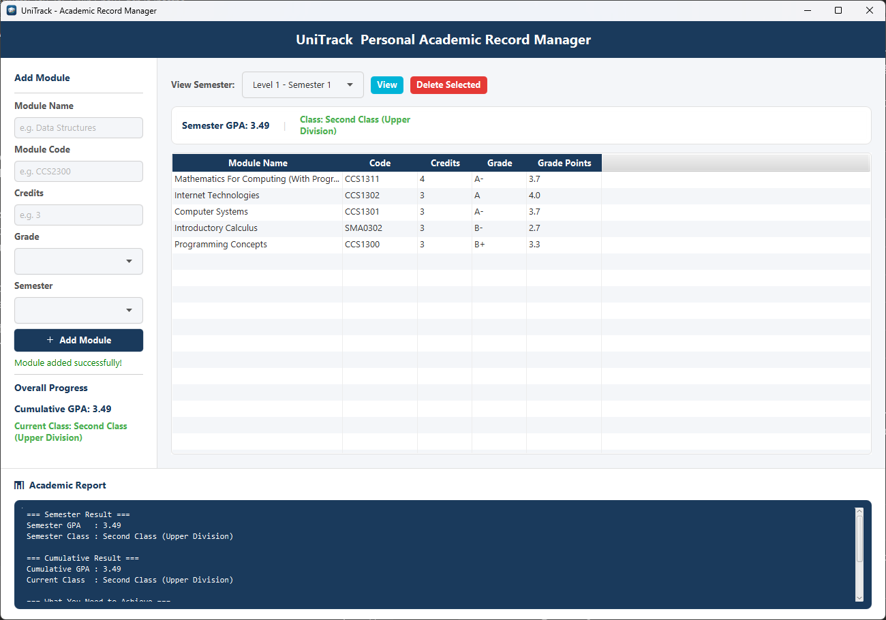
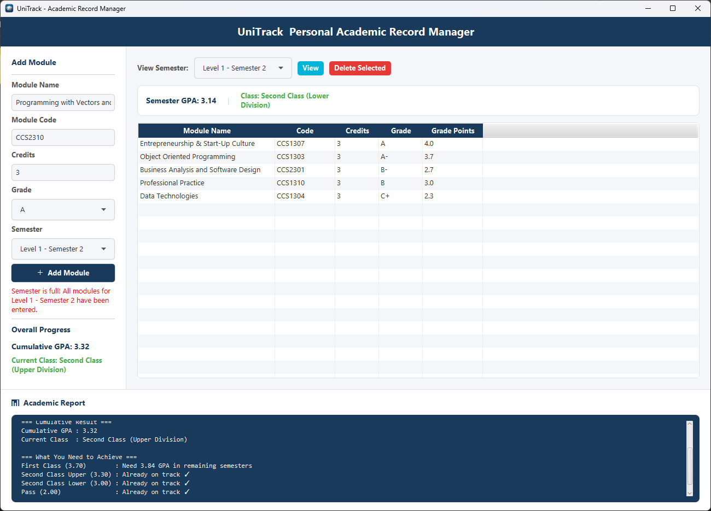
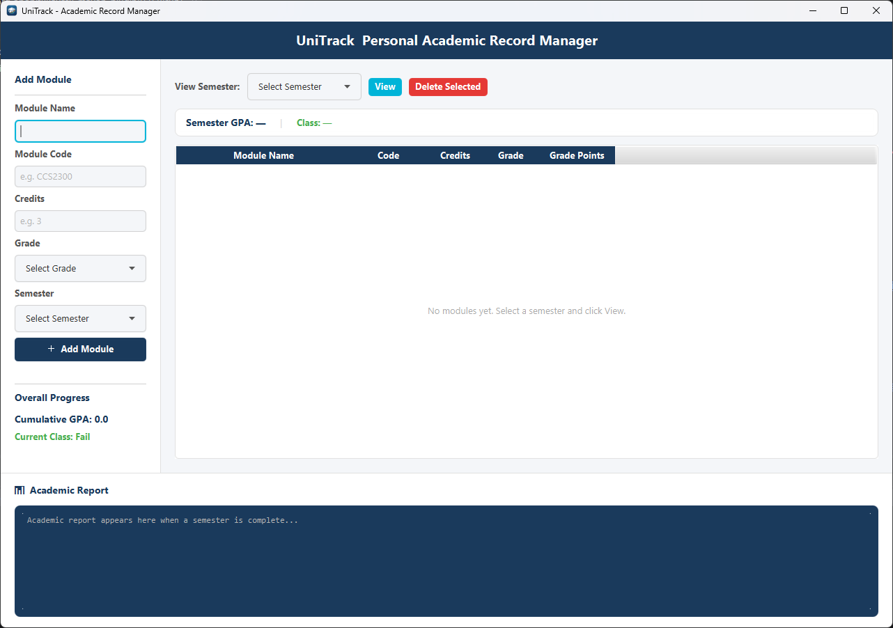

<h1 align="center">UniTrack — Personal Academic Record Manager</h1>

UniTrack is a desktop application for tracking university modules, calculating GPA, and monitoring academic progress across a full degree programme. It's built for students who don't have access to a centralized platform for viewing past results and cumulative GPA.

All data is stored locally — no internet connection or server required.

---

## Features

- **Module tracking** — add modules with name, code, credits, and grade per semester
- **Automatic GPA calculation** — weighted GPA computed from credits and letter grades, no manual grade-point entry needed
- **Semester locking** — once a semester's module limit is reached, new entries are blocked to prevent duplicate or incorrect data
- **Academic reports** — view semester GPA, cumulative GPA, current class standing, and the GPA required in remaining semesters to reach a target class
- **Persistent local storage** — data is saved between sessions using a local SQLite database; no need to re-enter records every time
- **Dropdown-only inputs** — semester and grade fields use dropdowns instead of free text to prevent data entry errors

---

## Tech Stack

| Layer | Technology |
|---|---|
| Language | Java 21+ |
| UI | JavaFX |
| Database | SQLite |
| Build Tool | Maven |
| Packaging | jpackage (.exe) |

---

## GPA Calculation

UniTrack uses a 4.0-scale GPA system with plus/minus grading (12 grade bands from A+ to E), a format used across many universities globally. The exact percentage-to-grade mapping and degree-class GPA cutoffs in this build are configured to a specific university's grading policy.

The formula used is the standard credit-weighted GPA:

```
GPA = Σ(credits × grade points) / Σ(credits)
```

To adapt this app for a different university's grading scale or class boundaries, edit the `GPACalculator` class in `src/main/java/com/akila/unitrack/model/`.

---

## Screenshots

### Dashboard


### Academic Report


### Semester Locking


### Empty Dashboard


---

## Getting Started

A packaged `.exe` build is available under [Releases](../../releases) for Windows. Download, install, and run — no setup required.

---

## Project Structure

```
UniTrack/
├── src/
│   └── main/
│       ├── java/com/akila/unitrack/
│       │   ├── controller/      # JavaFX UI controllers
│       │   ├── db/              # Database connection and DAO classes
│       │   ├── model/           # Module and GPA calculation logic
│       │   └── MainApp.java     # Application entry point
│       └── resources/com/akila/unitrack/
│           ├── dashboard.fxml   # Main UI layout
│           ├── styles.css       # Application styling
│           └── icon.png         # App icon
├── screenshots/                 # App screenshots used in this README
├── pom.xml
└── README.md

```

---

## License

This project is licensed under the MIT License — free to use, modify, and distribute.

---

## Author

Built by [Akila Deshan](https://github.com/Akila-Deshan) — BSc Honours in Data Science student.
